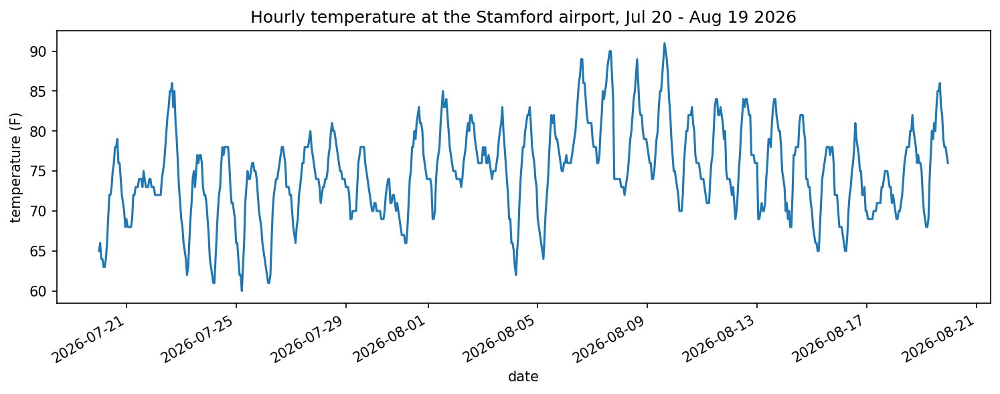
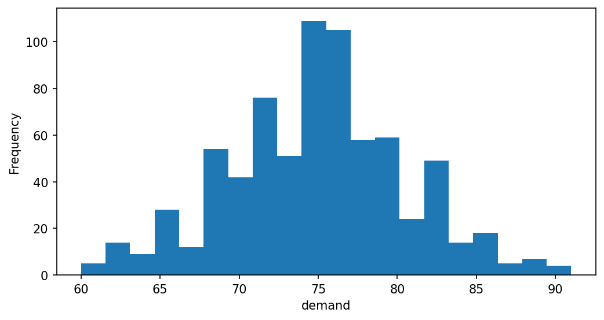
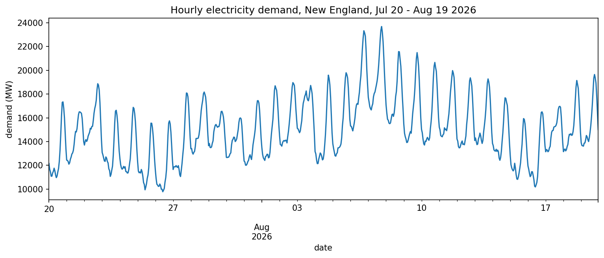
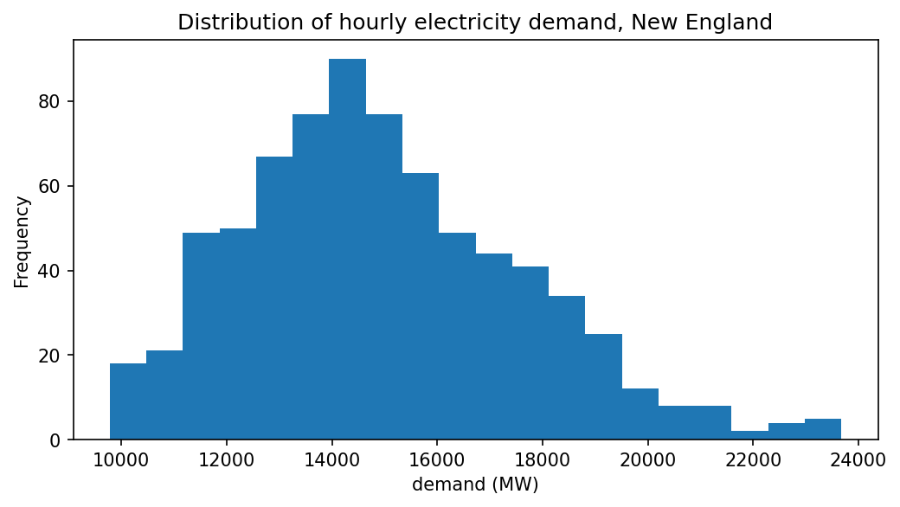

# Weather and our load — Lab 1 report

*Two people, two halves, one repo. Replace every ➜ line with a real sentence. Every number gets a unit.*

## 1. Temperature over the month

It was hottest around August 9th topping out at about 90 degrees F.

## 2. How often was it hot?

➜ One sentence: where do most hours sit, and how many hours were above 85 °F?

## 3. Demand over the month

Demand peaked at roughly 23,677 MW on August 7 at 6 PM, likely reflecting evening cooling load during a hot stretch.

## 4. How often was the grid working hard?

Most hours sit between 12,000 and 16,000 MW, with only 28 hours out of 744 climbing above 20,000 MW.

➜ One sentence: where do most hours sit, and how many hours were above 20,000 MW?

## 5. (Optional) Demand vs temperature

➜ One sentence a manager understands: *"each degree above \_\_\_ °F adds roughly \_\_\_ MW."*

## What this data can't tell us

It can tell us what the usage was during that time given the tempurature however, it can't tell us what will for sure happen in the future.
